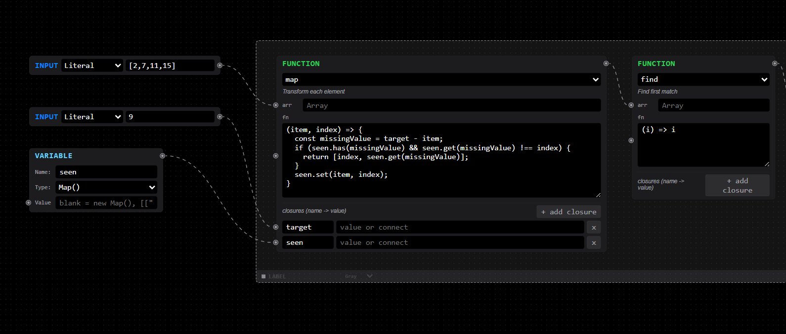
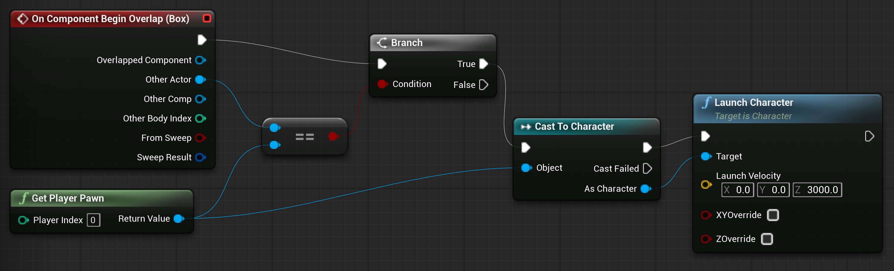
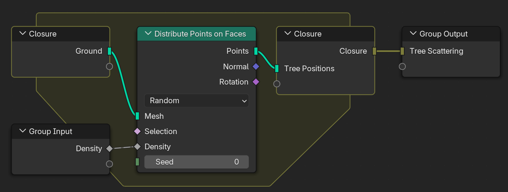

# Visual Programming

A node-based [visual programming](https://en.wikipedia.org/wiki/Visual_programming_language) environment built with React, [reactflow](https://reactflow.dev), and TanStack.

<picture>
  <source media="(prefers-color-scheme: dark)" srcset="docs/assets/image2.png">
  <source media="(prefers-color-scheme: light)" srcset="docs/assets/image.png">
  
</picture>

## Features

- **Node-based diagram** – drag, connect, and execute nodes visually using React Flow
- **Execution engine** – supports all JS operators (`+`, `-`, `*`, `/`, `%`, `**`, `===`, `!==`, `>`, `<`, `>=`, `<=`, `&&`, `||`, `??`) and built-in functions (Math, String, Array, Object, JSON)
- **Visual debugger (DRAFT)** – step through execution, highlight active nodes, watch variables, view execution trace
- **JSON support** – export the full flow to JSON, copy to clipboard, download, or import from a file
- **Module system (DRAFT)** – save the current flow as a reusable module and load it back into any flow
- **GitHub Actions coding agent** – label any issue with `approved-for-fix` to trigger the AI coding agent

## Node Types

| Node      | Description                                              |
| --------- | -------------------------------------------------------- |
| Input     | Static value input (string, number, boolean, JSON)       |
| Output    | Display the result of connected nodes                    |
| Variable  | Named variable that holds a value                        |
| Operator  | Binary math/logic operator                               |
| Function  | Built-in JS function (Math, String, Array, Object, JSON) |
| Condition | If/else branch based on a condition                      |
| Loop      | Array iteration (forEach, map, filter)                   |
| JSON      | JSON parse/stringify/get/set operations                  |

## Getting Started

```bash
pnpm install
pnpm dev
```

## Build

```bash
pnpm build
```

## Tech Stack

- [Vite](https://vitejs.dev/) + [React](https://react.dev/)
- [@xyflow/react](https://reactflow.dev/) – node-based diagram
- [@tanstack/react-query](https://tanstack.com/query) – async state management
- [@tanstack/react-table](https://tanstack.com/table) – data tables (available for future use)
- [Zustand](https://zustand-demo.pmnd.rs/) – UI state management

## More visual programming inspiration

Unreal Engine’s Blueprints


Blender


LabView

